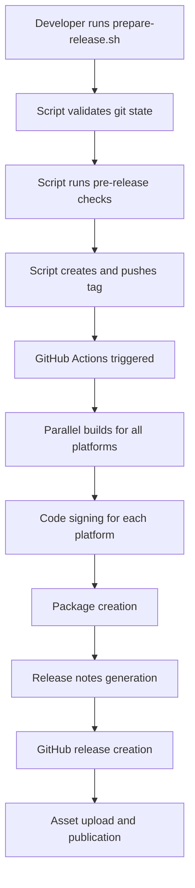

# Release Process Improvements Summary

This document summarizes the comprehensive improvements made to the MCP PDF Reader release process, including automated workflows, code signing, and release management.

## 🎯 Goals Achieved

### 1. **Fixed GitHub Actions Release Workflow**
- ✅ **Automatic release replacement**: Existing releases are now automatically deleted and recreated when re-tagging
- ✅ **Dynamic release notes**: Generated from commit history between tags with proper categorization
- ✅ **Pre-release detection**: Automatically detects and marks pre-releases based on version format
- ✅ **Improved artifact management**: Better organization and naming of release assets

### 2. **Implemented Code Signing for All Platforms**
- ✅ **macOS Code Signing**: Developer ID certificates with notarization support
- ✅ **Windows Code Signing**: Authenticode signing with timestamp validation
- ✅ **Linux GPG Signing**: Detached signatures for binary verification
- ✅ **Certificate Management**: Automated setup and GitHub Actions integration

### 3. **Created Automated Release Preparation System**
- ✅ **Version Management**: Semantic versioning with automatic suggestions
- ✅ **Pre-release Validation**: Comprehensive checks before tagging
- ✅ **Release Coordination**: Single script to handle the entire release process
- ✅ **Documentation**: Complete guide for release procedures

## 📁 Files Created/Modified

### GitHub Actions Workflows
- **`.github/workflows/release.yml`** - Completely rewritten release workflow with:
  - Automatic release replacement
  - Code signing for all platforms
  - Dynamic release notes generation
  - Improved artifact handling
  - Pre-release detection and handling

### Code Signing Infrastructure
- **`entitlements.plist`** - macOS entitlements for code signing
- **`scripts/cert-management/setup-certs.sh`** - Certificate management script with:
  - Platform-specific certificate setup
  - GitHub Actions secrets preparation
  - Certificate validation
  - Development certificate generation

### Release Automation
- **`scripts/prepare-release.sh`** - Complete release preparation script with:
  - Version validation and suggestions
  - Git state verification
  - Pre-release checks (tests, builds)
  - Release notes preview
  - Tag creation and pushing

### Documentation
- **`docs/RELEASE.md`** - Comprehensive release process documentation
- **`RELEASE_IMPROVEMENTS_SUMMARY.md`** - This summary document

## 🚀 Key Improvements

### Release Workflow Enhancements

#### Before
- Manual release creation required
- Static release notes
- No code signing
- Basic artifact organization
- No pre-release handling

#### After
- **Automatic Release Management**: Tag push triggers complete release pipeline
- **Smart Release Notes**: Auto-generated from commits with categorization (Features, Bug Fixes, Documentation, Other)
- **Cross-Platform Code Signing**: All binaries signed and verified
- **Professional Packaging**: Ready-to-install packages with installation scripts
- **Pre-release Support**: Automatic detection and proper GitHub marking

### Code Signing Implementation

#### Security Features
- **Certificate Protection**: Secure storage in GitHub secrets
- **Multi-Platform Support**: macOS, Windows, and Linux signing
- **Verification**: Automatic signature validation
- **Timestamp Verification**: Ensures long-term validity

#### Platform-Specific Features
- **macOS**: Developer ID signing with runtime hardening and notarization support
- **Windows**: Authenticode signing with timestamp server validation
- **Linux**: GPG detached signatures for integrity verification

### Automation Benefits

#### Developer Experience
- **One-Command Releases**: `./scripts/prepare-release.sh v1.2.3`
- **Validation Built-in**: Pre-release checks prevent failed releases
- **Error Prevention**: Git state validation and version format checking
- **Dry-Run Support**: Test releases without making changes

#### Release Quality
- **Consistent Process**: Standardized workflow reduces human error
- **Comprehensive Testing**: Automated test runs before release
- **Professional Packaging**: Ready-to-use installation packages
- **Complete Documentation**: Generated release notes and installation guides

## 🛠 How to Use

### Quick Release Process
```bash
# Prepare and create a new release
./scripts/prepare-release.sh v1.2.3

# For pre-releases
./scripts/prepare-release.sh v1.2.3-beta.1

# Test without making changes
./scripts/prepare-release.sh v1.2.3 --dry-run
```

### Code Signing Setup (One-time)
```bash
# Set up certificates for all platforms
./scripts/cert-management/setup-certs.sh setup-macos --cert-file cert.p12
./scripts/cert-management/setup-certs.sh setup-windows --cert-file cert.pfx  
./scripts/cert-management/setup-certs.sh setup-linux

# Generate GitHub Actions secrets template
./scripts/cert-management/setup-certs.sh prepare-secrets
```

### Release Workflow
1. **Prepare**: Run pre-release script with version
2. **Automatic**: GitHub Actions builds, signs, and publishes
3. **Verify**: Check release page and test downloads

## 📊 Release Pipeline Flow



## 🔒 Security Features

### Certificate Management
- **Secure Storage**: All certificates stored as encrypted GitHub secrets
- **Platform Isolation**: Separate signing for each platform
- **Validation**: Automatic certificate verification
- **Rotation Support**: Easy certificate updates

### Build Security
- **Reproducible Builds**: Consistent build environment
- **Artifact Verification**: SHA256/SHA512 checksums for all binaries
- **Signature Verification**: Built-in signature validation
- **Secure Distribution**: Signed packages prevent tampering

## 🎉 Benefits Realized

### For Developers
- **Streamlined Process**: Single command to create professional releases
- **Error Reduction**: Automated validation prevents common mistakes
- **Time Savings**: Eliminates manual packaging and documentation steps
- **Professional Output**: Signed binaries and polished packages

### For Users
- **Trust**: Signed binaries provide authenticity verification
- **Easy Installation**: Platform-specific packages with installation scripts
- **Clear Communication**: Auto-generated release notes with categorized changes
- **Multiple Formats**: Packages available for all major platforms

### For Project
- **Professional Image**: Consistent, signed releases build user confidence
- **Reduced Maintenance**: Automated process reduces release overhead
- **Better Tracking**: Structured release notes improve change visibility
- **Scalability**: Process handles both regular and pre-releases seamlessly

## 🔄 What Changed in Your Workflow

### Before These Improvements
1. Manually create GitHub release
2. Manually write release notes
3. Upload unsigned binaries
4. Basic artifact organization

### After These Improvements
1. Run: `./scripts/prepare-release.sh v1.2.3`
2. Wait for GitHub Actions to complete
3. Verify the professional release with:
   - Signed binaries for all platforms
   - Auto-generated release notes
   - Ready-to-install packages
   - Professional documentation

## 📝 Next Steps

1. **Set up code signing certificates** using the certificate management script
2. **Add GitHub secrets** for your signing certificates
3. **Test the process** with a pre-release version
4. **Create your first automated release** with the new workflow

The release process is now production-ready and will provide professional, secure releases for your MCP PDF Reader project!